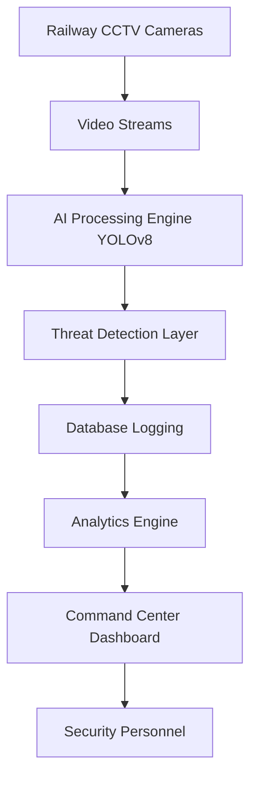
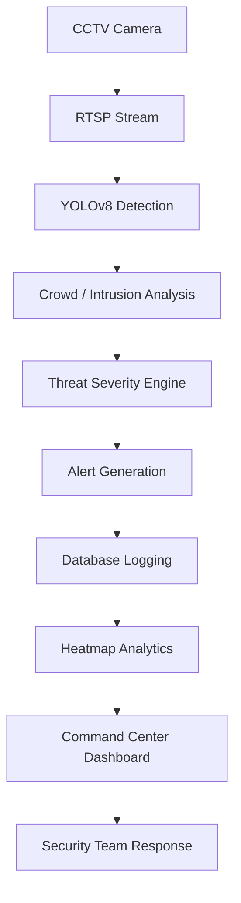

# 🚆 Rakshak AI – Smart Railway Safety Command Center

Smart Railway Safety Command Center for AI-based monitoring, crowd detection, intrusion analysis, and incident response.

---

## 📌 Introduction

This is a great time to create a professional README because Rakshak AI is no longer just an idea—it is a working MVP.

You received 5 hackathon themes and selected **Railway Safety & Smart Surveillance** because it solves a real-world problem affecting millions of passengers every day.

Rakshak AI is an AI-powered Railway Safety and Surveillance Platform designed to improve passenger security, crowd management, and incident response inside railway stations.

The project was developed as part of a hackathon challenge where multiple problem statements were provided. Out of the available themes, we selected **Railway Safety & Smart Surveillance** because railway stations handle thousands of passengers daily, making real-time monitoring difficult for human operators.

Traditional CCTV systems rely on security personnel continuously watching multiple camera feeds, which often leads to delayed responses and missed incidents.

Rakshak AI acts as an intelligent monitoring assistant that automatically detects crowd gatherings, track intrusions, suspicious situations, and generates actionable alerts for security teams.

---

## 🎯 Problem Statement

Railway stations face several operational challenges:

* Large crowds during peak hours
* Track intrusion incidents
* Limited human monitoring capability
* Delayed response to emergencies
* Difficulty managing multiple CCTV streams simultaneously
* Lack of centralized AI-powered monitoring

Security operators are expected to monitor dozens of camera feeds continuously, which is practically impossible.

Rakshak AI addresses these issues using Computer Vision, Artificial Intelligence, Analytics, and Command Center Operations.

---

## 💡 Solution Overview

Rakshak AI transforms traditional CCTV infrastructure into an intelligent surveillance system capable of:

* Detecting people automatically
* Monitoring crowd density
* Detecting track intrusions
* Tracking passenger movement
* Generating alerts
* Logging incidents
* Visualizing station activity
* Assisting emergency response teams

The system converts raw CCTV footage into actionable intelligence.

---

## 🏗️ System Architecture



---

## 🔄 Project Workflow



---

## 🔥 Core Features

### 1. Person Detection
The system detects passengers in real-time using YOLOv8.

### 2. Person Tracking
Rakshak AI tracks detected passengers across frames.

### 3. Crowd Gathering Detection
Detects abnormal crowd formations and triggers alerts for congestion risks.

### 4. Track Intrusion Detection
Detects individuals entering restricted railway track zones.

### 5. Crowd Density Heatmap
Generates visual crowd density maps for station planning and risk assessment.

### 6. Multi-Camera Monitoring
Supports simultaneous monitoring of multiple CCTV feeds.

### 7. Threat Severity Engine
Classifies incidents based on risk levels such as LOW, MEDIUM, HIGH, CRITICAL, and EMERGENCY.

### 8. Incident Logging System
All incidents are stored in SQLite with timestamp, camera ID, incident type, severity, and people count.

### 9. Evidence Snapshot System
Automatically captures evidence during critical events for investigations and audit support.

### 10. Emergency Dispatch Workflow
Allows security operators to dispatch response teams with zone, team, status, and timestamp details.

### 11. Digital Twin Zone Intelligence
Railway zones are represented digitally for location-specific monitoring.

### 12. Analytics Dashboard
Provides real-time operational insights such as incident totals, threat levels, camera status, passenger counts, and risk scores.

### 13. PDF Incident Reports
Generates downloadable audit reports with summaries, severity, evidence, camera information, and timelines.

---

## 🖥️ Command Center Dashboard

The dashboard serves as the operational hub for:

* Live Camera Monitoring
* Threat Statistics
* Incident Timeline
* Dispatch Controls
* Zone Intelligence Matrix
* Crowd Heatmaps
* Evidence Viewer
* Risk Analytics

---

## 🛠️ Technology Stack

### AI & Computer Vision
* YOLOv8
* OpenCV
* NumPy

### Backend
* Python
* SQLite

### Frontend
* Streamlit

### Data Visualization
* Plotly
* Matplotlib

### Reporting
* ReportLab

---

## 📂 Project Structure

Rakshak-AI

backend/
* multi_camera_monitor.py
* heatmap.py
* dispatch.py
* cleanup.py

frontend/
* dashboard.py

database/
* alerts.db
* init_db.py

alerts/
* Evidence Snapshots

reports/
* PDF Reports

datasets/
* Videos
* Images

models/
* yolov8n.pt

README.md

---

## 🚀 Future Scope

Future versions of Rakshak AI can include:

* RTSP Live CCTV Integration
* Missing Person Search
* Face Recognition Watchlists
* Weapon Detection
* Abandoned Object Detection
* WhatsApp Alerts
* SMS Notifications
* Email Alerts
* Cloud Deployment
* Railway-Wide Command Center

---

## 🎯 Impact

Rakshak AI helps railway authorities:

* Improve passenger safety
* Reduce monitoring workload
* Detect threats early
* Improve emergency response
* Enable AI-assisted decision making

The project transforms passive CCTV infrastructure into an intelligent railway security ecosystem.

---

## 📌 MVP Summary

Rakshak AI is currently implemented as a working MVP with:

* real-time CCTV monitoring
* person detection and tracking
* crowd gathering analysis
* track intrusion detection
* alert logging and evidence capture
* dashboard-based visualization for operational monitoring

---

## 🧠 Why This Theme Was Chosen

Among the five hackathon themes, Railway Safety & Smart Surveillance was selected because it directly addresses a major public safety issue in high-traffic stations where manual monitoring is limited and incident response can be delayed.

---

## 🔍 What Makes Rakshak AI Different

* AI-assisted surveillance instead of manual CCTV observation
* Faster threat recognition and alert generation
* Centralized monitoring for multiple feeds
* Practical support for station safety and emergency response
* A scalable foundation for future railway command center applications

This makes Rakshak AI a strong MVP for real-world railway safety operations and hackathon presentation.

---

## ⚙️ Getting Started

```bash
pip install -r requirements.txt
streamlit run frontend/dashboard.py
```

---

<!-- ## 👨‍💻 Developed By

Piyush Mandal

B.Tech Computer Science (AI & ML)

Rakshak AI – Smart Railway Safety Command Center

"Protecting Passengers Through Intelligent Surveillance" -->

